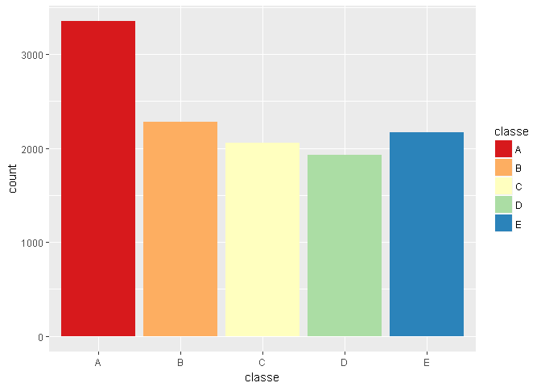
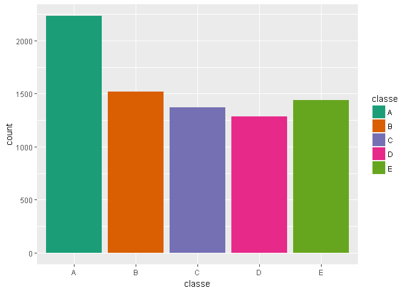
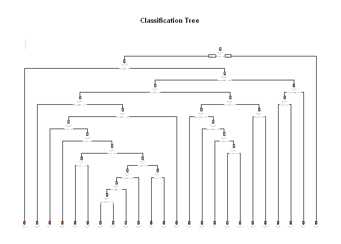

Classifying Weightlifting Project
================
Fabio Sena
22 de abril de 2017

``` r
# Packages
required.packages <- c("data.table", "ggplot2", "caret", "rpart", "rpart.plot", "randomForest", "e1071")
load.or.install.package <- function(x) {
  if (!require(x, character.only=TRUE)) {
    install.packages(x)
    library(x)
    "Installed and Loaded"
  } else {
    "Loaded"
  }
}
sapply(required.packages, load.or.install.package)
```

    ##   data.table      ggplot2        caret        rpart   rpart.plot 
    ##     "Loaded"     "Loaded"     "Loaded"     "Loaded"     "Loaded" 
    ## randomForest        e1071 
    ##     "Loaded"     "Loaded"

``` r
# Reproducability
set.seed(997)
```

``` r
# Data
training_file_name   <- './data/pml-training.csv'
testing_file_name <- './data/pml-testing.csv'

# Directories
setwd("C:\\DataCamp\\classifying-weightlifting-project")
if (!file.exists("data")) (dir.create("data"))
if (!file.exists("submission")) dir.create("submission")

if(!file.exists(training_file_name)) 
  download.file('http://d396qusza40orc.cloudfront.net/predmachlearn/pml-training.csv', training_file_name, quiet = FALSE)

if(!file.exists(testing_file_name)) 
  download.file('http://d396qusza40orc.cloudfront.net/predmachlearn/pml-testing.csv', testing_file_name, quiet = FALSE)

# Load datasets
na.strings <- c("NA","#DIV/0!", "")
pml_training <- fread(training_file_name, na.strings = na.strings, sep = ",")
pml_testing <-fread(testing_file_name , na.strings = na.strings)

pml_training <- pml_training[,-c(1:7)]
pml_testing  <- pml_testing[,-c(1:7)]  

# Data cleaning
pml_training <- pml_training[, colSums(is.na(pml_training)) == 0, with = FALSE]
pml_testing <- pml_testing[, colSums(is.na(pml_testing)) == 0, with = FALSE]
```

Overview
--------

This report examines the Weight Lifting Exercises (WLE) Dataset to predict the quality of lifting weights from activity monitors. The quality is represented by the variable class that has 5 levels:

-   Class A: according to the specification
-   Class B: elbows to the front
-   Class C: lifting halfway
-   Class D: lowering halfway
-   Class E: hips to the front

Preparing data for training and testing
---------------------------------------

Creating a 60%/40% train and test split.

``` r
# Spliting training and testing sets
indexes <- createDataPartition(y = pml_training$classe, p=0.6, list = FALSE)
training_set <- pml_training[indexes, ] 
testing_set <- pml_training[-indexes, ]
```

Exploratory analysis
--------------------

``` r
# Training set
ggplot(training_set, aes(x = classe, fill = classe)) + geom_bar() + scale_fill_brewer(palette="Spectral")
```



``` r
# Testing set
ggplot(testing_set, aes(x = classe, fill = classe)) + geom_bar() + scale_fill_brewer(palette="Dark2")
```

 The plot shows how the classes are distributed in the dataset.

Prediction models
-----------------

### Decision Tree

First we train (fit) the classification tree model on the training set, plot model tree, predict the classification on testing set and show the confution matrix.

``` r
# Train Classification Tree Model
tree_model <- rpart(classe ~ ., data = training_set, method="class")

# Plot Classification Tree
rpart.plot(tree_model, main="Classification Tree", extra=102, under=TRUE, faclen=0)
```



``` r
# Prediction Classification Tree model
tree_model_predicted <- predict(tree_model, testing_set, type = "class")

# Show Classification Tree confusion matrix
confusion_matrix_tree_model <- confusionMatrix(tree_model_predicted, testing_set$classe)
confusion_matrix_tree_model
```

    ## Confusion Matrix and Statistics
    ## 
    ##           Reference
    ## Prediction    A    B    C    D    E
    ##          A 2079  323   22  138   49
    ##          B   42  760  105   49  100
    ##          C   61  216 1132  117  112
    ##          D   30   90   87  879  110
    ##          E   20  129   22  103 1071
    ## 
    ## Overall Statistics
    ##                                                
    ##                Accuracy : 0.7547               
    ##                  95% CI : (0.745, 0.7641)      
    ##     No Information Rate : 0.2845               
    ##     P-Value [Acc > NIR] : < 0.00000000000000022
    ##                                                
    ##                   Kappa : 0.688                
    ##  Mcnemar's Test P-Value : < 0.00000000000000022
    ## 
    ## Statistics by Class:
    ## 
    ##                      Class: A Class: B Class: C Class: D Class: E
    ## Sensitivity            0.9315  0.50066   0.8275   0.6835   0.7427
    ## Specificity            0.9052  0.95322   0.9219   0.9517   0.9572
    ## Pos Pred Value         0.7962  0.71970   0.6911   0.7349   0.7963
    ## Neg Pred Value         0.9708  0.88837   0.9620   0.9388   0.9429
    ## Prevalence             0.2845  0.19347   0.1744   0.1639   0.1838
    ## Detection Rate         0.2650  0.09686   0.1443   0.1120   0.1365
    ## Detection Prevalence   0.3328  0.13459   0.2088   0.1524   0.1714
    ## Balanced Accuracy      0.9183  0.72694   0.8747   0.8176   0.8500

``` r
tree_model_error <- 1 - confusion_matrix_tree_model$overall['Accuracy']
```

#### Classification Tree Model Error

``` r
sprintf("Classification Tree Model Error: %3.2f", tree_model_error * 100)
```

    ## [1] "Classification Tree Model Error: 24.53"

### Random Forest

Then we train (fit) the random forest model on the training set, plot model tree, predict the classification on testing set and show the confution matrix. During preprocessing, principal component analysis (PCA) is used to reduce the dimensionality of the data (feature reduction) while preserving the data's essential variance. With the cv method parameter, we tune the training function to use k-folds cross validation.

``` r
# Fit model
train_control <- trainControl(method="cv", number=5, verboseIter = FALSE , preProcOptions="pca")
random_forest_model <- train(classe ~ ., data = training_set, method="rf", trControl = train_control, ntree = 50)

# Perform prediction
random_forest_predicted <- predict(random_forest_model, testing_set, type = "raw")

# Show Random forest confusion matrix
confusion_matrix_random_forest <- confusionMatrix(random_forest_predicted, testing_set$classe)
random_forest_error <- 1 - confusion_matrix_random_forest$overall['Accuracy']
```

#### Random Forest Model Error

``` r
sprintf("Random Forest Model Error: %3.2f", random_forest_error * 100)
```

    ## [1] "Random Forest Model Error: 0.75"

### Test Case

Finale we predict final pml testing set and write the submission since the random forest model proved to be the most accurate.

``` r
final_predict <- predict(random_forest_model, pml_testing)

write.csv(as.data.table(final_predict), "./submission/submission.csv")
```

Citations
---------

Velloso, E.; Bulling, A.; Gellersen, H.; Ugulino, W.; Fuks, H. Qualitative Activity Recognition of Weight Lifting Exercises. Proceedings of 4th International Conference in Cooperation with SIGCHI (Augmented Human '13) . Stuttgart, Germany: ACM SIGCHI, 2013.
